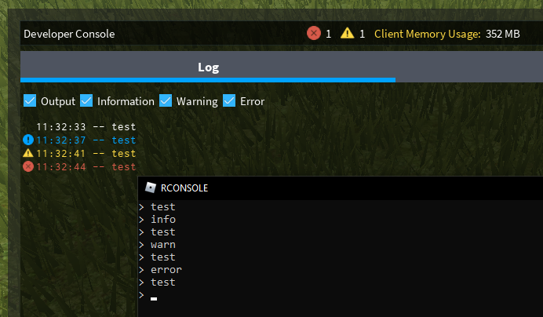

# RCONSOLE
A console-based exploit that prints to the in-game developer console in 4 different modes. 
Based on Vindict's version but updated to fix the `StartProcessException...` issue. 
 
 
<!---
RCONSOLE is a console based exploit for ROBLOX that only has one implemented function: printing to the developer console.
All credits for methods used in this source that are not mine goes to their rightful founders.
This repository is for educational purposes only.
-->
